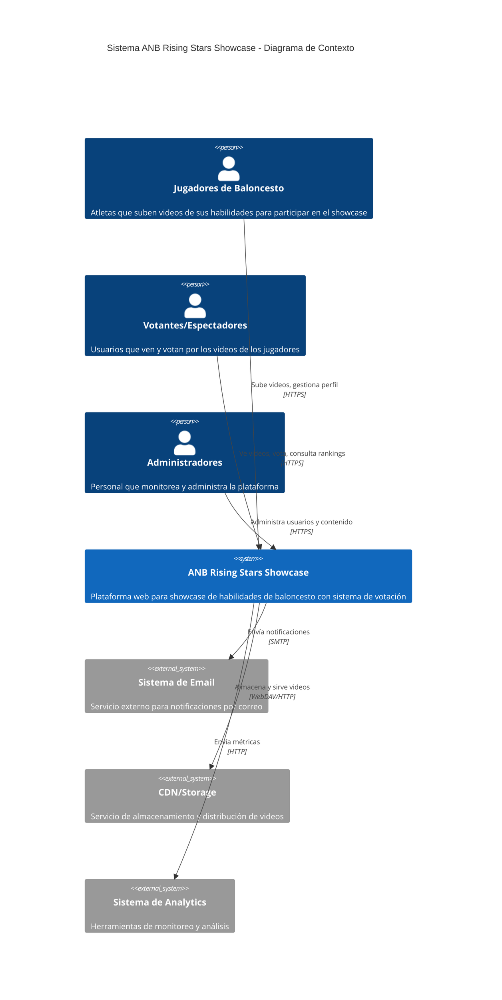
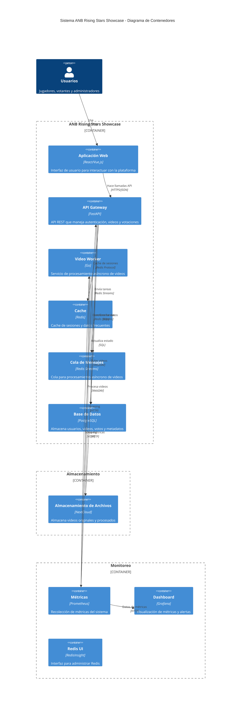
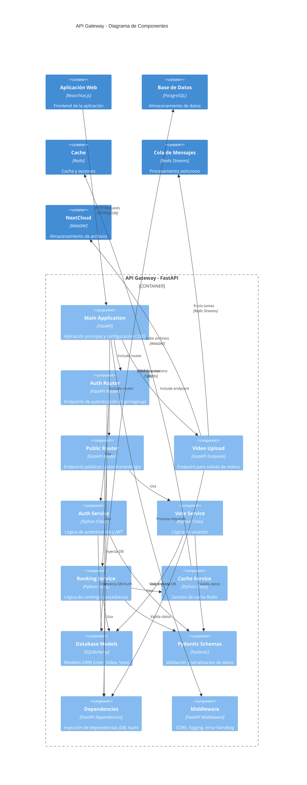

# Diagramas C4 - ANB Rising Stars Showcase

Este documento presenta los diagramas C4 (Context, Containers, Components, Code) para el sistema ANB Rising Stars Showcase, una plataforma de showcase de habilidades de baloncesto donde los jugadores pueden subir videos y recibir votos de la comunidad.

## 1. Diagrama de Contexto (C1)



## 2. Diagrama de Contenedores (C2)



## 3. Diagrama de Componentes (C3) - API Gateway



## 4. Diagrama de Código (C4) - Modelos de Datos

```mermaid
C4Component
    title Modelos de Datos - Diagrama de Código

    Container_Boundary(models_boundary, "Database Models (SQLAlchemy)") {
        Component(user_model, "User Model", "SQLAlchemy Model", "id: UUID, email: str, first_name: str, last_name: str, password: str, city: str, country: str")
        Component(video_model, "Video Model", "SQLAlchemy Model", "id: UUID, user_id: UUID, raw_video_id: UUID, processed_video_id: UUID, title: str, status: VideoStatus, uploaded_at: DateTime, processed_at: DateTime, original_url: str, processed_url: str, votes: int")
        Component(vote_model, "Vote Model", "SQLAlchemy Model", "user_id: UUID (PK), video_id: UUID (PK)")
        Component(video_status, "VideoStatus Enum", "Python Enum", "uploaded, processed, deleted")
    }

    Container_Boundary(schemas_boundary, "Pydantic Schemas") {
        Component(user_signup, "UserSignup", "Pydantic Model", "email: EmailStr, first_name: str, last_name: str, password: str, city: str, country: str")
        Component(user_login, "UserLogin", "Pydantic Model", "email: EmailStr, password: str")
        Component(user_auth_response, "UserAuthResponse", "Pydantic Model", "access_token: str, token_type: str, user: UserResponse")
        Component(video_upload_response, "VideoUploadResponse", "Pydantic Model", "message: str, task_id: str")
        Component(vote_response, "VoteResponse", "Pydantic Model", "message: str, video_id: UUID, total_votes: int")
        Component(ranking_response, "RankingResponse", "Pydantic Model", "videos: List[VideoRanking], pagination: PaginationInfo")
    }

    Container_Boundary(services_boundary, "Service Classes") {
        Component(auth_service_class, "AuthService", "Python Class", "authenticate_user(), register_user(), create_access_token(), verify_token()")
        Component(vote_service_class, "VoteService", "Python Class", "vote_for_video(), has_user_voted(), get_video_votes()")
        Component(ranking_service_class, "RankingService", "Python Class", "get_public_videos_ranking(), get_top_videos(), get_ranking_stats()")
        Component(cache_service_class, "CacheService", "Python Class", "get(), set(), delete(), exists(), get_or_set()")
    }

    ' Relaciones entre modelos
    Rel(user_model, video_model, "One-to-Many", "videos relationship")
    Rel(user_model, vote_model, "One-to-Many", "votes relationship")
    Rel(video_model, vote_model, "One-to-Many", "vote_records relationship")
    Rel(video_model, video_status, "Uses", "status field")

    ' Relaciones servicios con modelos
    Rel(auth_service_class, user_model, "CRUD operations")
    Rel(vote_service_class, vote_model, "CRUD operations")
    Rel(vote_service_class, video_model, "Read/Update votes")
    Rel(ranking_service_class, video_model, "Read operations")
    Rel(ranking_service_class, cache_service_class, "Caching")

    ' Relaciones schemas con modelos
    Rel(user_signup, user_model, "Creates")
    Rel(user_login, auth_service_class, "Validates")
    Rel(user_auth_response, auth_service_class, "Returns")
    Rel(vote_response, vote_service_class, "Returns")
    Rel(ranking_response, ranking_service_class, "Returns")

    UpdateLayoutConfig($c4ShapeInRow="2", $c4BoundaryInRow="1")
```

## Descripción de los Diagramas

### 1. Contexto (C1)
Muestra el sistema ANB Rising Stars Showcase en su entorno, con los diferentes tipos de usuarios (jugadores, votantes, administradores) y los sistemas externos con los que interactúa.

### 2. Contenedores (C2)
Detalla la arquitectura de microservicios del sistema, incluyendo:
- **API Gateway (FastAPI)**: Maneja la lógica de negocio y endpoints REST
- **Video Worker (Go)**: Procesa videos de forma asíncrona
- **Base de Datos (PostgreSQL)**: Almacena datos estructurados
- **Cache (Redis)**: Mejora el rendimiento y maneja colas de mensajes
- **NextCloud**: Almacenamiento de archivos de video
- **Monitoreo**: Prometheus y Grafana para observabilidad

### 3. Componentes (C3)
Se enfoca en la estructura interna del API Gateway, mostrando:
- **Routers**: Organizan endpoints por funcionalidad
- **Services**: Contienen la lógica de negocio
- **Models**: Definen la estructura de datos
- **Schemas**: Validan entrada y salida de datos
- **Dependencies**: Manejan inyección de dependencias

### 4. Código (C4)
Muestra las clases y relaciones principales del modelo de datos:
- **Modelos SQLAlchemy**: User, Video, Vote con sus relaciones
- **Schemas Pydantic**: Para validación y serialización
- **Clases de Servicio**: Encapsulan la lógica de negocio

## Tecnologías Utilizadas

- **Backend**: FastAPI (Python), Go
- **Base de Datos**: PostgreSQL
- **Cache/Cola**: Redis
- **Almacenamiento**: NextCloud (WebDAV)
- **Monitoreo**: Prometheus, Grafana
- **Contenedores**: Docker, Docker Compose
- **ORM**: SQLAlchemy
- **Validación**: Pydantic
- **Autenticación**: JWT
