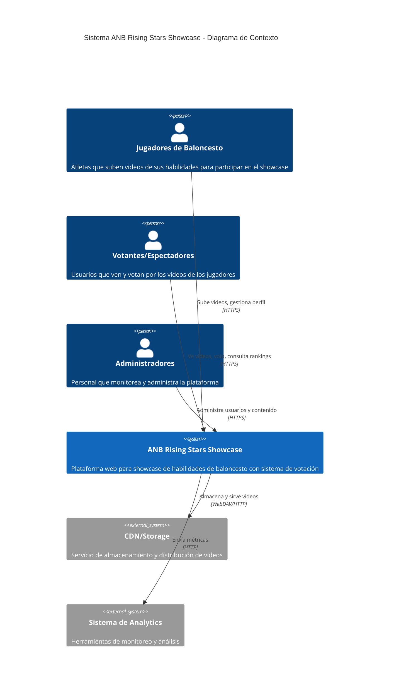
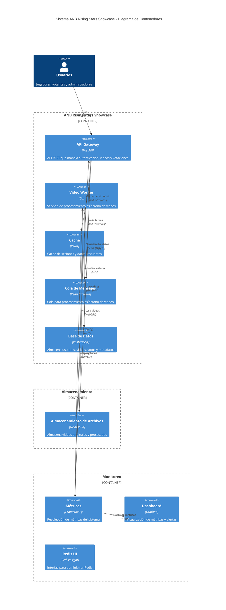
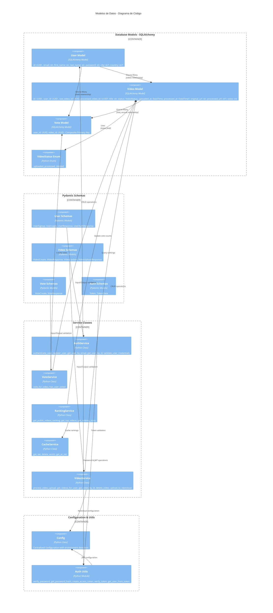
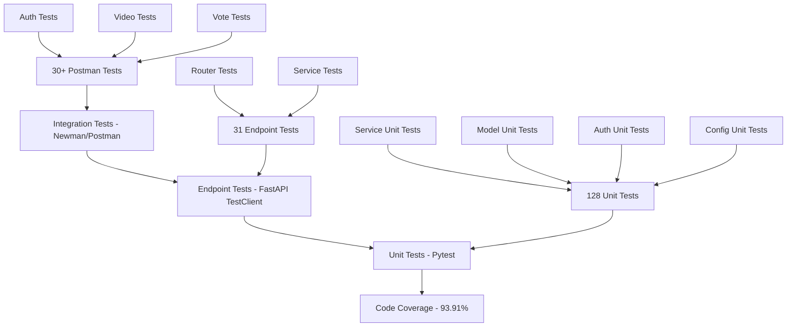

# Diagramas C4 - ANB Rising Stars Showcase

Este documento presenta los diagramas C4 (Context, Containers, Components, Code) para el sistema ANB Rising Stars Showcase, una plataforma de showcase de habilidades de baloncesto donde los jugadores pueden subir videos y recibir votos de la comunidad.

## 1. Diagrama de Contexto (C1)

## 2. Diagrama de Contenedores (C2)

## 3. Diagrama de Componentes (C3) - API Gateway

```mermaid
C4Component
    title API Gateway - Diagrama de Componentes

    Container(database, "Base de Datos", "PostgreSQL", "Almacenamiento de datos")
    Container(cache, "Cache", "Redis", "Cache y sesiones")
    Container(message_queue, "Cola de Mensajes", "Redis Streams", "Procesamiento asíncrono")
    Container(file_storage, "NextCloud", "WebDAV", "Almacenamiento de archivos")

    Container_Boundary(api_boundary, "API Gateway - FastAPI") {
        Component(main_app, "Main Application", "FastAPI", "Aplicación principal, configuración CORS y health check")
        Component(config_module, "Config Module", "Python Class", "Configuración centralizada y variables de entorno")
        
        Component(auth_router, "Auth Router", "FastAPI Router", "Endpoints de autenticación (/api/auth)")
        Component(public_router, "Public Router", "FastAPI Router", "Endpoints públicos (/api/public)")
        Component(videos_router, "Videos Router", "FastAPI Router", "Endpoints de gestión de videos (/api/videos)")
        
        Component(auth_service, "Auth Service", "Python Class", "Autenticación, registro y JWT")
        Component(vote_service, "Vote Service", "Python Class", "Lógica de votación y validaciones")
        Component(ranking_service, "Ranking Service", "Python Class", "Rankings públicos con paginación")
        Component(cache_service, "Cache Service", "Python Class", "Gestión de cache Redis")
        Component(video_service, "Video Service", "Python Class", "Upload, validación y gestión de videos")
        
        Component(db_models, "Database Models", "SQLAlchemy", "User, Video, Vote, VideoStatus")
        Component(pydantic_schemas, "Pydantic Schemas", "Pydantic", "12 schemas de validación y respuesta")
        Component(dependencies, "Dependencies", "FastAPI Dependencies", "get_current_user, get_db")
        Component(auth_utils, "Auth Utils", "Python Module", "JWT, password hashing, token verification")
        
        Component(middleware, "CORS Middleware", "FastAPI Middleware", "Cross-origin resource sharing")
    }

    Rel(main_app, config_module, "Loads config")
    Rel(main_app, middleware, "CORS handling")
    Rel(main_app, auth_router, "Include router")
    Rel(main_app, public_router, "Include router")
    Rel(main_app, videos_router, "Include router")
    
    Rel(auth_router, auth_service, "Delegates business logic")
    Rel(public_router, vote_service, "Handles voting")
    Rel(public_router, ranking_service, "Handles rankings")
    Rel(public_router, video_service, "Gets published videos")
    Rel(videos_router, video_service, "Handles video operations")
    
    Rel(auth_service, auth_utils, "Uses JWT functions")
    Rel(auth_service, db_models, "User CRUD")
    Rel(vote_service, db_models, "Vote, Video CRUD")
    Rel(ranking_service, db_models, "Video queries")
    Rel(ranking_service, cache_service, "Caching rankings")
    Rel(video_service, db_models, "Video CRUD")
    
    Rel(auth_service, pydantic_schemas, "UserSignup, UserLogin, UserAuthResponse")
    Rel(vote_service, pydantic_schemas, "VoteResponse")
    Rel(video_service, pydantic_schemas, "VideoUploadResponse, VideoResponse")
    Rel(ranking_service, pydantic_schemas, "Video schemas")
    
    Rel(auth_router, dependencies, "get_db")
    Rel(public_router, dependencies, "get_current_user, get_db")
    Rel(videos_router, dependencies, "get_current_user, get_db")
    
    Rel(db_models, database, "ORM Queries", "SQL")
    Rel(cache_service, cache, "Cache operations", "Redis Protocol")
    Rel(video_service, message_queue, "Video processing tasks", "Redis Streams")
    Rel(video_service, file_storage, "Upload/download videos", "WebDAV")
    Rel(video_service, config_module, "Nextcloud config")

    UpdateLayoutConfig($c4ShapeInRow="3", $c4BoundaryInRow="1")
```

## 4. Diagrama de Código (C4) - Modelos de Datos

## Descripción de los Diagramas

### 1. Contexto (C1)
Muestra el sistema ANB Rising Stars Showcase en su entorno, con los diferentes tipos de usuarios (jugadores, votantes, administradores) y los sistemas externos con los que interactúa.

### 2. Contenedores (C2)
Detalla la arquitectura de microservicios del sistema, incluyendo:
- **API Gateway (FastAPI)**: Maneja la lógica de negocio y endpoints REST
- **Video Worker (Go)**: Procesa videos de forma asíncrona
- **Base de Datos (PostgreSQL)**: Almacena datos estructurados
- **Cache (Redis)**: Mejora el rendimiento y maneja colas de mensajes
- **NextCloud**: Almacenamiento de archivos de video
- **Monitoreo**: Prometheus y Grafana para observabilidad

### 3. Componentes (C3)
Se enfoca en la estructura interna del API Gateway, mostrando la arquitectura real implementada:
- **3 Routers**: auth (autenticación), public (votación/rankings), videos (gestión de videos)
- **5 Services**: AuthService, VoteService, RankingService, CacheService, VideoService
- **Config Module**: Configuración centralizada con detección de entorno
- **Auth Utils**: Utilidades JWT y hashing de contraseñas
- **Dependencies**: get_current_user, get_db para inyección de dependencias
- **12 Pydantic Schemas**: Validación completa de entrada y salida

### 4. Código (C4)
Muestra las clases y relaciones reales del sistema implementado:
- **Database Models**: User, Video, Vote con relaciones One-to-Many y composite keys
- **Pydantic Schemas**: 12 schemas organizados por funcionalidad (User, Video, Vote, Auth)
- **Service Classes**: 5 servicios con métodos específicos implementados
- **Configuration**: Gestión centralizada de configuración con validación
- **Auth Utils**: Funciones de seguridad para JWT y contraseñas

## 5. Arquitectura de Testing

El proyecto implementa una arquitectura de testing completa con múltiples niveles:

### Testing Pyramid Implementado

### Cobertura de Testing por Componente

- **Unit Tests (128 tests)**: 100% pass rate
  - VideoService: 30 tests (100% coverage)
  - AuthService: 17 tests (100% coverage) 
  - Auth Utils: 24 tests (100% coverage)
  - Database Models: 19 tests (100% coverage)
  - Configuration: 28 tests (100% coverage)

- **Integration Tests (31 endpoint tests)**: 100% pass rate
  - Video endpoints: 13 tests
  - Authentication: 18 tests

- **API Tests (30+ Postman tests)**: Newman compatible
  - Authentication scenarios: 8 tests
  - Video management: 21 tests
  - Voting system: 8 tests

## Tecnologías Utilizadas

- **Backend**: FastAPI (Python), Go
- **Base de Datos**: PostgreSQL
- **Cache/Cola**: Redis
- **Almacenamiento**: NextCloud (WebDAV)
- **Monitoreo**: Prometheus, Grafana
- **Contenedores**: Docker, Docker Compose
- **ORM**: SQLAlchemy
- **Validación**: Pydantic
- **Autenticación**: JWT
- **Testing**: Pytest, Newman, FastAPI TestClient
- **Coverage**: pytest-cov (93.91% coverage)
