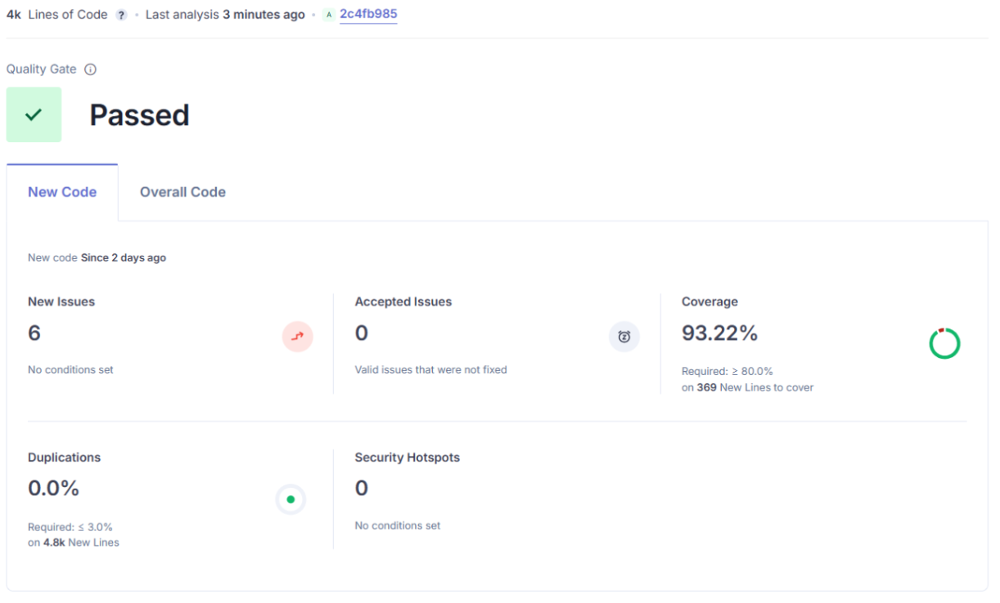
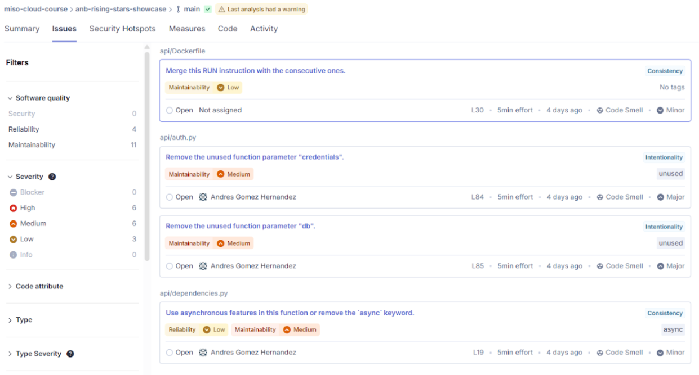
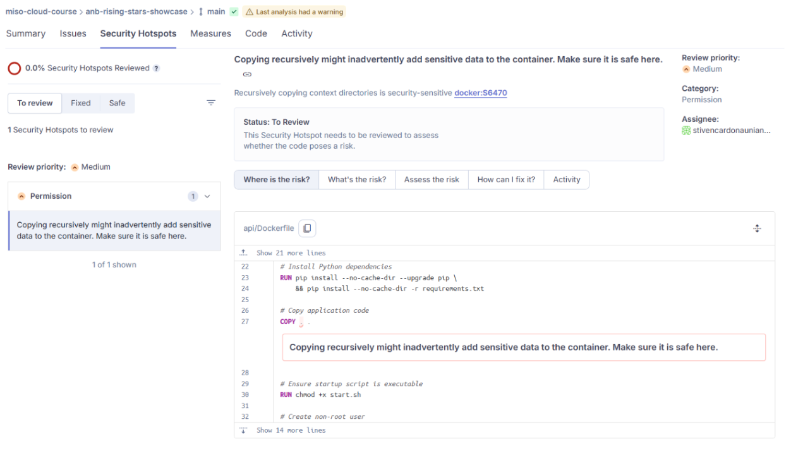
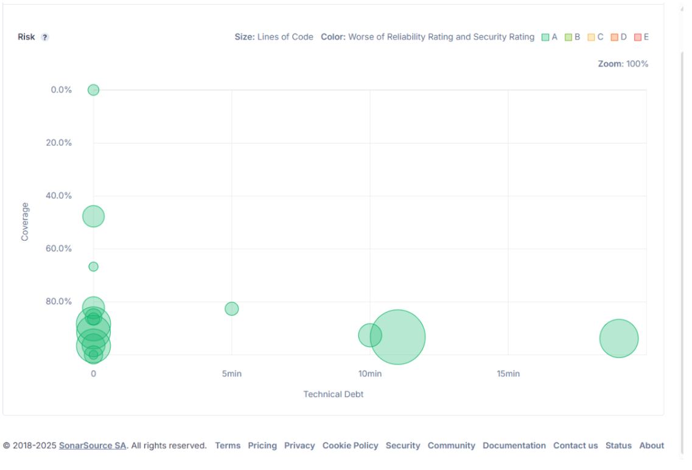
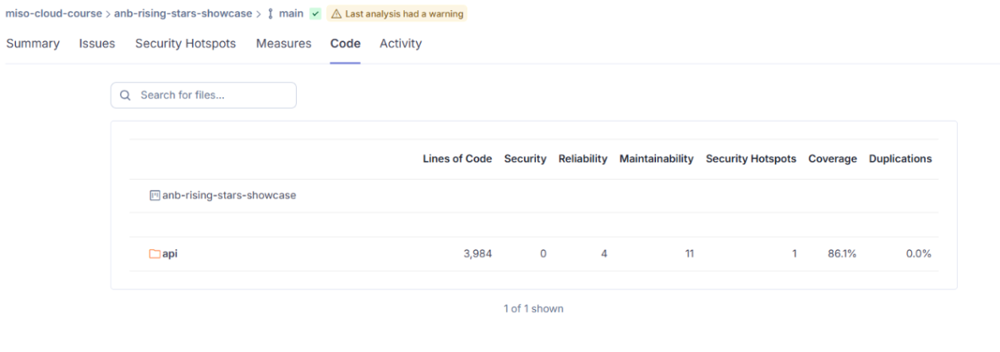

# Documentación de entrega 1

## Definición de diagrama entidad-relación


## Glosario:

|Nombre|Tipo|Descripción|
|------|----|-----------|
|USER|ENTIDAD |Representa a un usuario del sistema. Los usuarios pueden registrarse en el sistema, subir videos para ser votados por otros usuarios o votar.|
|VOTES|RELACIÓN| Representa un voto en el sistema. Es una relación de muchos a muchos, un usuario puede votar por varios videos y un video puede ser votado por múltiples usuarios.|
|VIDEO|ENTIDAD|Es un video que es subido al sistema por un usuario. Los videos son procesados en el backend del sistema. Finalmente, los videos son votados y ranqueados en base al número de votos recibidos.|


## Diagrama de componentes


## Diagrama de despliegue


Los componentes se despliegan en contenedores docker utilizando docker-compose.

## Instrucciones de ejecución:
### Pre-requisitos:
* Haber instalado docker en el ordenador, servidor o instancia dónde se vaya a ejecutar la aplicación.
* Haber clonado la aplicación desde el repositorio https://github.com/stivencardonauniandes/anb-rising-stars-showcase
* Verificar que haya permisos de lectura en el directorio ./api
### Ejecución
* Se debe crear un archivo .env en el directorio ./worker/configs con la configuración para la correcta comunicación con los demás componentes del sistema. Un ejemplo de este archivo se puede encontrar en https://github.com/stivencardonauniandes/anb-rising-stars-showcase/blob/main/worker/configs/.env.example
* Asimismo, definir un archivo .env en el directorio ./api con las conexiones a la base de datos y a nextcloud. Un ejemplo de este archivo se puede encontrar en https://github.com/stivencardonauniandes/anb-rising-stars-showcase/blob/main/api/.env.local.example
* Ejecutar los contenedores utilizando el comando:
```
docker-compose up --build
```
* En caso de querer detener la aplicación eliminando los volúmenes y las imágenes creadas localmente, utilizar el comando
```
docker-compose down -v --rmi local
```

## Diagrama de flujo de carga de un archivo


[Ver en alta definición](https://drive.google.com/file/d/12-lQ8Lry7MZezcmXqS74ZT5CKAGtTre_/view?usp=sharing)


## Reporte de Sonarqube

### Análisis general



Estado del quality gate: Aprobado

### Análisis de issues

#### Distribución de Issues por severidad:
* 6 de alta severidad
* 6 de mediana severidad
* 3 de baja severidad
#### Distribución de issues por tipo:
* Confiabilidad: 4
* Mantenibilidad: 11

### Análisis de seguridad


Se encuentra con un hotspot de seguridad relacionado con la copia recursiva al interior de los contenedores de docker. Esto puede causar que información sensible sea copiada al interior de los contenedores.

### Coverage vs technical debt



### Reporte de código

* 86% de cobertura en el código del backend de servicios de FastAPI
* 0% de duplicación de líneas de código.
* 3984 líneas de código en total.