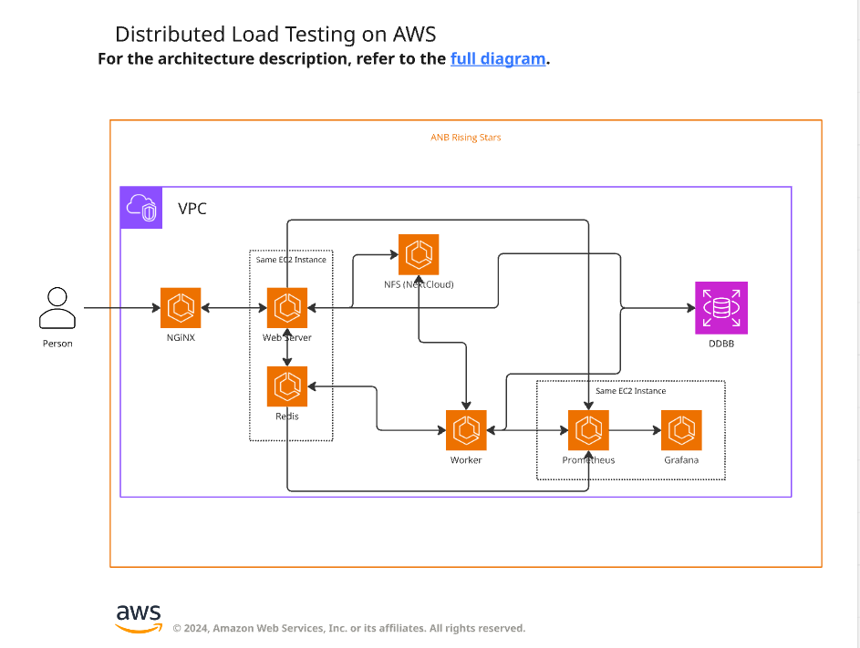

# Documentación Entrega 2

## Diagrama de componentes


## Diagrama de despliegue actualizado


Se despliegan los componentes untilizando los servicios de AWS Amazon EC2 y Amazon RDS. En la mayoría de casos se utilizan instancias de EC2 independientes para cada uno de los servicios exceptuando dos casos particualres.

1. El el API desarrollado en Fast y la cola de mensajes comparten la misma instancia de EC2.

2. Los componentes de monitoreo Grafana y Prometeus comparten la misma instancia.

## Otras modificaciones realizadas

A nivel de código, se generan dockerfiles independientes para cada uno de los servicios con el fin de facilitar su instalación y despliegue en cada una de las instancias EC2 de AWS. Con la nueva configuración del código, la aplicación se puede continuar ejecutando localmente utilizando el archivo docker-compose.yml pero adicionalmente se puede ejecutar en ambientes de producción utilizando los comandos de docker indicados en cada uno de los Readme que se encuentran en las carpetas individuales.

* Instrucciones para configuracion inicial de instancias EC2 de AWS: [Instrucciones de ejecución](../aws/ec2/initial-configuration.md)

* Para NGINX: [Instrucciones de ejecución](../nginx/Readme.md)

* Para el API: [Instrucciones de ejecución](../aws/ec2/api/run-instructions.md)

* Para el service worker: [Instrucciones de ejecución](../aws/ec2/worker/run-instructions.md)

* Para redis: [Instrucciones de ejecución](../aws/ec2/redis/run-instructions.md)

* Para nextcloud: [Instrucciones de ejecución](../aws/ec2/nextcloud/run-instructions.md)

## Correcciones de SonarQube realizadas

* Se corrige un issue relacionado con el uso del método ```datetime.utcnow()``` pues este es un método deprecado y su uso no es recomendado en su lugar se utiliza el método ```datetime.now(timezone.utc)``` que es un método que permite la conversión entre timezones.

* Se corrige el uso de condicionales en los archivos .sh, en lugar de utilizar ```[condicional]``` se utiliza la sintaxis correcta, la cual es ```[[condicional]]```

* Se refactoriza el código en la clase ```video_service.py:VideoService```para evitar la duplicación de código. Para esto se centralizan los mensajes de error en constantes de la clase para no duplicar mensajes en los diferentes métodos.

El PR con las correcciones correspondientes se puede encontrar en https://github.com/stivencardonauniandes/anb-rising-stars-showcase/pull/38/files