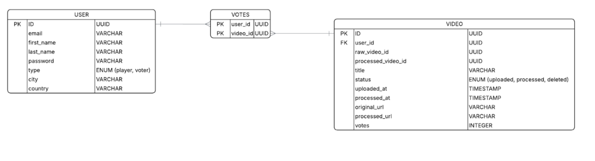
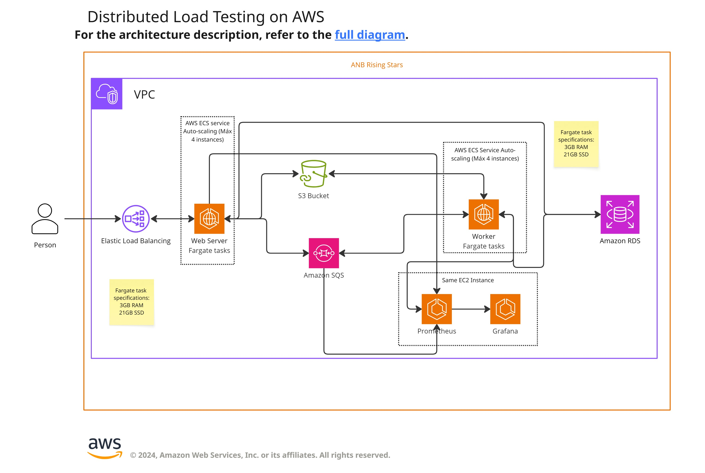

# Documentación entrega 5

## Definición de diagrama entidad-relación

## Glosario:

|Nombre|Tipo|Descripción|
|------|----|-----------|
|USER|ENTIDAD |Representa a un usuario del sistema. Los usuarios pueden registrarse en el sistema, subir videos para ser votados por otros usuarios o votar.|
|VOTES|RELACIÓN| Representa un voto en el sistema. Es una relación de muchos a muchos, un usuario puede votar por varios videos y un video puede ser votado por múltiples usuarios.|
|VIDEO|ENTIDAD|Es un video que es subido al sistema por un usuario. Los videos son procesados en el backend del sistema. Finalmente, los videos son votados y ranqueados en base al número de votos recibidos.|

## Diagrama de componentes

## Diagrama de despliegue

## Diagrama de flujo

## Modificaciones realizadas

1. El servicio API se transfiere de EC2 a Fargate tasks. En lugar escalarse utilizando auto-scaling groups ahora se utilizan las políticas de escalado de Fargate. En este caso se definió un número mínimo de tasks de 2 y un número máximo de 4.

1. El worker se transfiere de EC2 a Fargate tasks. En lugar escalarse utilizando auto-scaling groups ahora se utilizan las políticas de escalado de Fargate. En este caso se definió un número mínimo de tasks de 2 y un número máximo de 4.